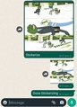

# Whatsticker

A simple whatsapp bot that turns pictures into stickers and nothing more

## Usage

 - Run script and login on `Link Device` with the QR code shown in terminal
 - Run `docker build .` to create the docker image and then run docker image wherever you want
 - Wherever your number is i.e group chats, private chats, send an image with the caption `stickerize deven96`. This works whether your phone is online or not
 

WARNING: Docker image will contain `examplestore.db` which has your login credentials and can be used to send messages as you so never expose image publicly

