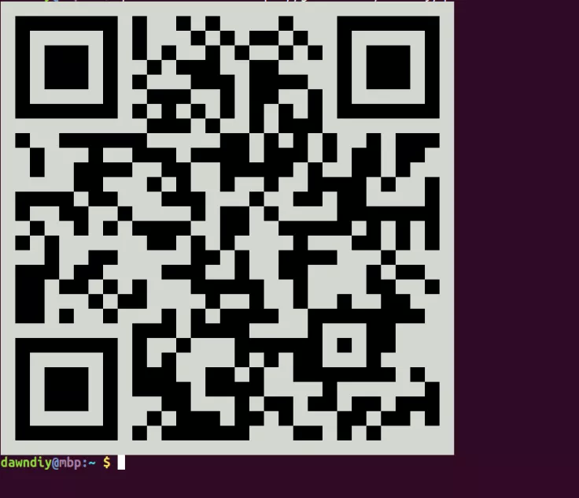

# Whatsticker

<p align="left"></p>
A Whatsapp bot that turns pictures, small videos and gifs into stickers with the caption <b><u><a name="caption">stickerize deven96</u></a></b>

[Chat with Whatsticker](https://wa.me/19293792260)


## Usage


### Simple Requirements

If you are not interested in running a copy of the project then feel free to use the whatsticker number provided. You can also add it to group chats and it will work the exact same way. There might be occasional downtime but except it gets blocked it should be pretty reliable

### Technical Requirements

 - [Go 1.17](https://go.dev/)
 - [Docker Compose](https://docs.docker.com/compose/install/)

### Generating Credentials

 - Download Go modules

   ```bash
   # Downloads go modules
   go mod tidy
   ```
 - Run `go run main.go` to show qr code for login on terminal

   

 - Link device as explained on [WhatsApp FAQ](https://faq.whatsapp.com/web/download-and-installation/how-to-link-a-device/)

 A folder `db/` will be automatically created containing sqlite db with credentials. No need to login over and over except logged out on main device. You can copy this folder to target machine and it still works

### Running The Bot

 - Ensure `db/examplestore.db` exists and run `docker-compose up`
 - Open any chat (Personal/Group) where the logged in number is present
 - Send media with [caption](#caption) and number should respond with sticker

  

**WARNING**: `db/` folder on root will contain `examplestore.db` which docker-compose expects to load as a volume. Do not create a public image using this folder or commit to version control as it can be used to impersonate you

## CLI Flags

The following flags are available

- `-log-level` : To switch between log verbosity between `INFO` and `DEBUG`
- `-reply-to`  : Set to true if bot should quote original messages with reply
- `-sender`    : Respond to only this jid e.g `234XXXXXXXXXX`


## Flow

```
|___ metadata                        # Customizes sticker exif information
|    |__ metadata.go
|    |__ raw.exif.tpl
|
|├── handler                         # Contains logic for running sticker procedure on images/video
|    |___ handler.go
|    |___ image.go
|    |___ video.go
|
|├── LICENSE
|├── main.go                         # Login to WA client and sets up event handler
|└── README.md
```

* Initializes WA client (new credentials in db or uses existing)
* Sets up `eventHandler` to monitor all incoming events and passes WA client to media handler [handler.Run()](https://github.com/deven96/whatsticker/blob/main/handler/handler.go#:~:text=Run)
* Four possible messages trigger the core media handler
  - Image with [caption](#caption) for `GroupChat Messages` or Image without caption for `Private Messages`
  - Video with [caption](#caption) for `GroupChat Messages` or Video without caption for `Private Messages`
  - GIF with [caption](#caption)   for `GroupChat Messages` or GIF without caption for `Private Messages`
  - Text matching correct caption that quotes an image/video/gif ( media type and content gets set to quoted media)
* One of either [`Handler`](https://github.com/deven96/whatsticker/blob/main/handler/handler.go#:~:text=type%20Handler)  gets initialized based on media type
  - `Video/GIF` make use of [`Video{}`](https://github.com/deven96/whatsticker/blob/main/handler/video.go#:~:text=type%20Video)
  - `Image` makes use of [`Image{}`](https://github.com/deven96/whatsticker/blob/main/handler/image.go#:~:text=type%20Image)
* `Handler` has some methods that get run
  - _SetUp_ : set client to WA client, reply to option and create folders for media if not exist
  - _Validate_: enforce some constraints on media size/length
  - _Handle_: Downloads the raw media -> Converts media to webP (as WhatsApp stickers are wrappers around webp images) using the specified codec -> Appends exif information to webp Image -> Uploads it to WA -> Return a sticker message
  - _SendResponse_: Sends sticker to originating chat
  - _CleanUp_: Remove raw and converted media from file system

## Limits/Issues

 - [ ] _Media sizes/length enforced by code_
 - [ ] _Some sticker results for videos are not animated (WebP size exceeds 1MB)_
 - [ ] _Sometimes original media cannot be downloaded (especially for quoting older media messages with caption)_
 - [ ] _reply-to flag causes iOS users to be [incorrectly tagged](https://github.com/tulir/whatsmeow/issues/135)_

## License

This project is opened under the [MIT License](LICENSE) which allows very broad use for both academic and commercial purposes

## Credits

Library/Resource | Use
------- | -----
[tulir/whatsmeow](https://github.com/tulir/whatsmeow) | whatsmeow is a Go library for the WhatsApp web multidevice API.
[ffmpeg](https://ffmpeg.org) | A complete cross platform solution to record, convert and stream video (and audio).
[cwebp](https://developers.google.com/speed/webp/docs/cwebp) | Compress an image file into WebP file
[webpmux](https://developers.google.com/speed/webp/docs/webpmux) | Write exif file to set metadata on stickers
