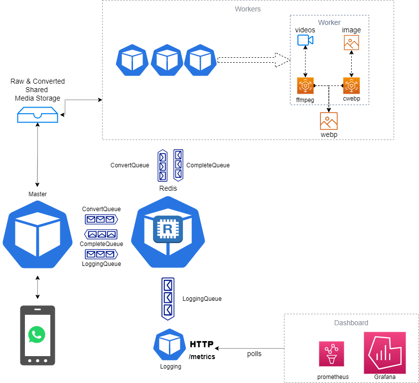

# Whatsticker

<p align="left"></p>
A Whatsapp bot that turns pictures, small videos and gifs into stickers


[Chat with Whatsticker](https://wa.me/15550089659)


## Usage

https://user-images.githubusercontent.com/23453888/172902050-7e039696-2b31-469f-8d39-c900b80fae4b.mp4

### Simple Requirements

If you are not interested in running a copy of the project then feel free to use the whatsticker number provided. You can also add it to group chats and it will work the exact same way. There might be occasional downtime but except it gets blocked it should be pretty reliable

### Technical Requirements

 - [Go 1.17](https://go.dev/)
 - [Docker Compose](https://docs.docker.com/compose/install/)
 - [Ngrok](https://ngrok.com/)

### Setting up

 - Download Go modules

   ```bash
   # Downloads go modules
   go mod tidy
   ```
 - Create a meta business app for whatsapp cloud API found here [WhatsApp FAQ](https://developers.facebook.com/docs/whatsapp/cloud-api/get-started). Make sure to add the whatsapp [product](https://developers.facebook.com/docs/development/create-an-app/app-dashboard#products-2) for the app.
 - Retrieve the access token from the app to be later used as `BEARER_ACCESS_TOKEN`
 - Start ngrok on port 9000 (using us region or adding the webhook would be an [issue](https://github.com/inconshreveable/ngrok/issues/427))
  
   ```bash
   ngrok -http 9000 --region us
   ```
 - Create a webhook by following [Configure WebHook](https://developers.facebook.com/docs/whatsapp/cloud-api/get-started#configure-webhooks) and add the ngrok link given to you. Save the verify token add to be later used as `VERIFY_TOKEN`.
 - Configure the webhook to [subscribe to messages](https://developers.facebook.com/docs/graph-api/webhooks/getting-started#configure-webhooks-product).


### Running The Bot

 - Export the necessary tokens
 
  ```bash
  export VERIFY_TOKEN=<xxxxxxx>
  export BEARER_ACCESS_TOKEN=<xxxxxxx>
  ```
 - Run `docker-compose up`.
 - In development you have to [add your number to the test numbers in the app](https://developers.facebook.com/docs/whatsapp/cloud-api/get-started/add-a-phone-number/) (or just [message the running bot in production](https://wa.me/15550089659))
 - Send media in chat and bot should respond with sticker


## Architecture


Open the [architecture](assets/arch-diag.drawio) on [draw.io](https://draw.io) 


## Limits/Issues

 - [X] _Media sizes/length enforced by whatsapp (100KB image, 500KB video)_
 - [ ] _Video conversion takes time using ffmpeg to be able to whittle away at quality in order to achieve 500KB_
 - [ ] _Animated stickers (from videos) may not maintain aspect ratio_

## License

This project is opened under the [MIT License](LICENSE) which allows very broad use for both academic and commercial purposes

## Credits

Library/Resource | Use
------- | -----
[tulir/whatsmeow](https://github.com/tulir/whatsmeow) | whatsmeow is a Go library for the WhatsApp web multidevice API.
[ffmpeg](https://ffmpeg.org) | A complete cross platform solution to record, convert and stream video (and audio).
[cwebp](https://developers.google.com/speed/webp/docs/cwebp) | Compress an image file into WebP file
[webpmux](https://developers.google.com/speed/webp/docs/webpmux) | Write exif file to set metadata on stickers
[prometheus](https://github.com/prometheus/client_golang) | Live metrics of stickerization 
